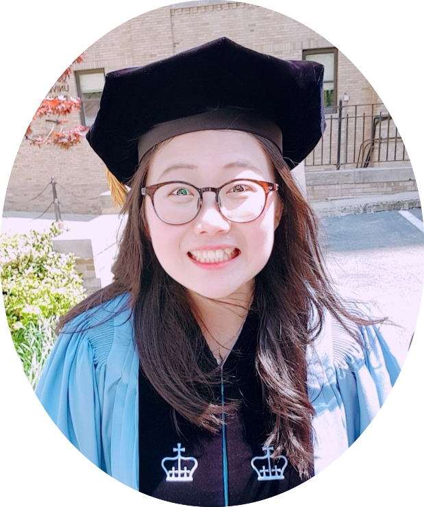

<link rel="apple-touch-icon" sizes="180x180" href="/favicon/apple-touch-icon.png">
<link rel="icon" type="image/png" sizes="32x32" href="/favicon/favicon-32x32.png">
<link rel="icon" type="image/png" sizes="16x16" href="/favicon/favicon-16x16.png">
<link rel="manifest" href="/favicon/site.webmanifest">
<link rel="mask-icon" href="/favicon/safari-pinned-tab.svg" color="#5bbad5">
<meta name="msapplication-TileColor" content="#da532c">
<meta name="theme-color" content="#ffffff">

  

  

#### About

I received a PhD in biostatistics from [Columbia University](https://www.mailman.columbia.edu/become-student/departments/biostatistics) in 2018. My dissertation advisors are Dr. [Jeff Goldsmith](http://jeffgoldsmith.com) and Dr. [Gen Li](https://sites.google.com/view/ligen). My dissertation is available [here](https://doi.org/10.7916/D8N603XB). Prior to that, I received a BS in statistics from [University of Seoul](http://www.uos.ac.kr/en/) in 2011 and a MS in statistics from [Seoul National University](http://en.snu.ac.kr) in 2013. 

 

#### Curriculum Vitae
My full CV is available [here](download/[Jihui Lee] Resume.pdf).

 

#### Contact Information

Email: [jihui.lee94@gmail.com](mailto:jihui.lee94@gmail.com)  
GitHub: [github.com/jihuilee/](http://github.com/jihuilee/)
