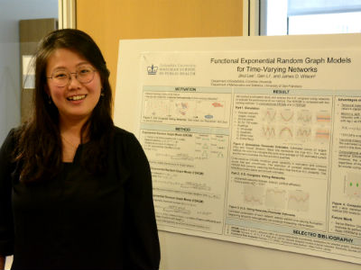

  

### Contributed

* Joint Statistical Meetings (JSM), Baltimore, MD, July 31, 2017 
    + *Varying-coefficient models for dynamic networks* (Speed oral and poster presentations)
* North American Social Networks (NASN) Conference, Washington, DC, July 28, 2017
    + *Varying-coefficient models for dynamic networks* (Panel presentation)
* Political Networks (PolNet) Workshops and Conference, Columbus, OH, June 15, 2017 
    + *Varying-coefficient models for dynamic networks* (Panel presentation)
* Data Science Institute (DSI), Columbia University, New York, NY, April 05, 2017
    + *Varying-coefficient models for dynamic networks* (Data Science Day: Poster presentation)
* Eastern North American Region (ENAR), Washington, DC, March 14, 2017
    + *Varying-coefficient models for dynamic networks* (Student Paper Award Winnner: Panel presentation)
* Data Science Institute (DSI), Columbia University, New York, NY, September 29, 2016
    + *Functional Exponential Random Graph Models for Time-Varying Networks* (DSI Poster Social and Competition: First runner-up)
    
### Invited

* Columbia Biostatistics Computing Club (CBCC), Columbia University, New York, NY, February 23, 2017,
    + *The beauty of ggplot2*

* Graduate Student Research Seminars (GSRS), Columbia University, New York, NY, October 13, 2016, 
    + *Incorporating the Function-on-Scalar Regression with Curve Registration via Variational Bayes*

* Functional Data Analysis Working Group (FDAWG), Columbia University, New York, NY, October 11, 2016,
    + *A Family of Functional Exponential Random Graph Models for Dynamic Networks with Temporal Heterogeneity*

* Functional Data Analysis Working Group (FDAWG), Columbia University, New York, NY, March 29, 2016,
    + *Functional Exponential Random Graph Models for Smoothly Transitioning Networks*

* Graduate Student Research Seminars (GSRS), Columbia University, New York, NY, March 24, 2016, 
    + *Functional Exponential Random Graph Models for Smoothly Transitioning Networks*

* P8111 Linear Regression Models (Guest Lecturer), Columbia University, New York, NY, March 03, 2015,
    + *Weighted and Generalized Least Squares*

* Functional Data Analysis Working Group (FDAWG), Columbia University, New York, NY, February 24, 2015, 
    + *Data Visualization with ggplot2*
    
  

I LOVE presenting my ideas and projects!

