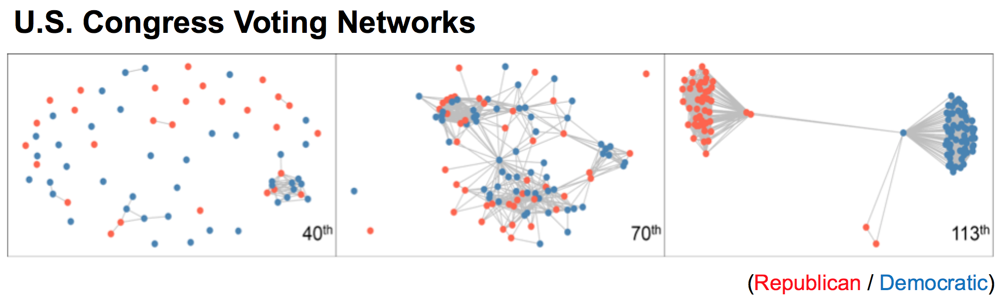

  

#### Research Interests

My research interests are vastly in 

1) Functional Data Analysis
2) Statistical Analysis of Complex Networks 
3) Data Mining and Machine Learning

 

#### Ongoing Projects

Projects I am currently working on are:

1. Dynamic Network Analysis: Varying-Coefficient Exponential Random Graph Models (VCERGMs)

  

2. Functional Registration

  

