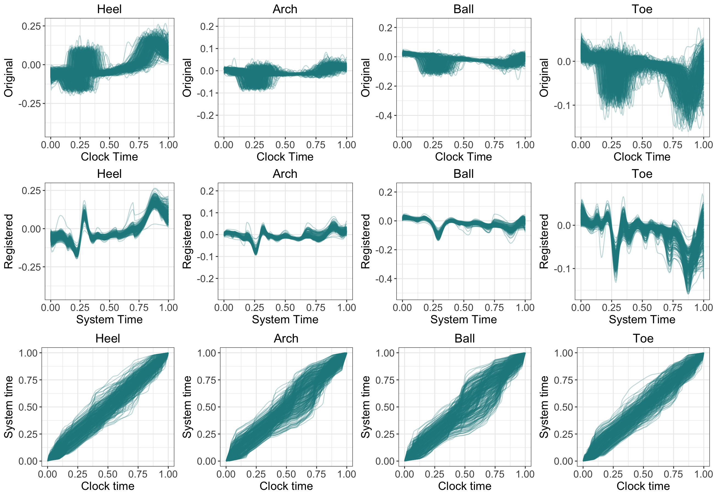

  

### Research Interests

My research interests are vastly in 

* Functional Data Analysis
* Statistical Analysis of Complex Networks 
* Data Mining and Machine Learning

 

### In Preparation

Projects I am currently working on are:

* **Detecting Changes in Congressional Twitter Networks**: Applying VCERGM to understand the evolution and detect the changes in congressional networks in Twitter.
* **Effect of Co-Administration of Long-Acting Insulin in Acute Management of Diabetic Ketoacidosis**: Examing the efect of long-acting insulin in addition to IV insulin infusion as a treatment of diabetic ketoacidosis.
* **Examining Patterns of Abnormality in Multiple Phenotype Traits among 16p11.2 Deletion / Duplication Children**: Finding patterns of childeren with 16p11.2 deletion / duplication to understand the profiles of abnormaility with respect to diagnosing autism spectrum disorder.

 

### Submitted Papers

1. Dynamic Network Analysis: Varying-Coefficient Exponential Random Graph Models (VCERGMs)

  

Effectively making inference on dynamic networks is a computationally challenging task, and many dynamic network models are intractable even for moderately sized networks. In this paper, we propose and investigate a family of dynamic network models, known as varying-coefficient exponential random graph models (VCERGMs), that characterize the evolution of network topology through smoothly varying parameters. The VCERGM provides an interpretable dynamic network model that enables the inference of temporal heterogeneity in dynamic networks. We establish how to fit the VCERGM through maximum pseudo-likelihood techniques, and provide a computationally tractable method for statistical inference of complex dynamic networks. We furthermore devise a bootstrap hypothesis testing framework for testing the temporal heterogeneity of an observed dynamic network sequence.

Preprint is available [here](https://arxiv.org/abs/1702.03632).

2. Functional Registration

  

In this study, we explore the properties of continuous in-shoe sensor recordings using a functional data analysis approach. We separate the sources of variability (phase and amplitude) via curve registration. We examine the correlation of phase shifts across sensors within a stance to evaluate the pattern of phase variability shared across sensors. Using the registered curves, we explore possible associations between in-shoe sensor recordings and GRF measurements to evaluate the in-shoe sensor recordings as a possible surrogate for in-lab GRF measurements.

Preprint is available upon request.

  
I LOVE collaboration!
