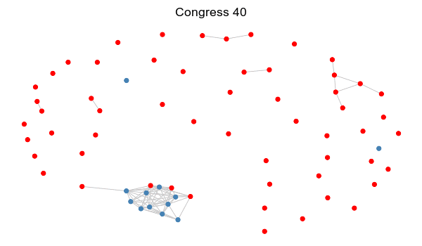
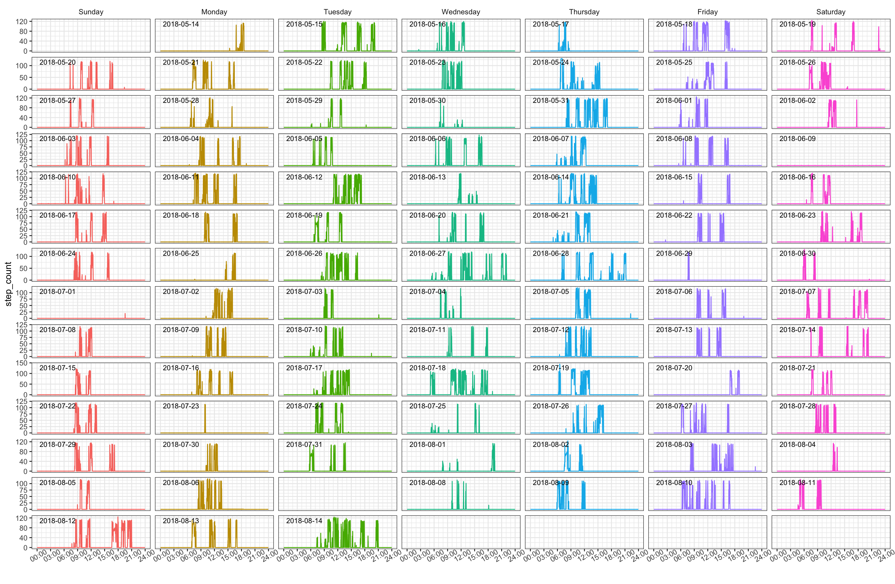

  

<link rel="stylesheet" href="academicons/css/academicons.min.css"/>

### R Packages

 

##### 1. ['VCERGM'](https://github.com/jihuilee/VCERGM)

The R package `VCERGM` implements varying-coefficient random graph models (VCERGMs) on dynamic networks. Available on [GitHub](https://github.com/jihuilee/VCERGM).

  

##### 2. ['DigiPheno'](https://github.com/jihuilee/DigiPheno)

The R package `DigiPheno` preprocesses and visualizes smartphone or wearable device data. It also provides functional data analysis approaches to analyze the data. Available on [GitHub](https://github.com/jihuilee/DigiPheno).

  

  

### Lecture Notes & Slides

 

##### 1. SAS Lecture Notes

I have taught **P6110: Statistical Computing with SAS** for 7 semesters. Topics covered in class include:

- data manipulation
- data summary and visualization
- hypothesis testing 
- linear regression models
- generalized linear models
- survival data analysis
- longitudinal data analysis

I would be happy to share my lecture notes. Relevant SAS example codes are also available upon request.

 

##### 2. [Beauty of ggplot2](download/[Jihui Lee] ggplot2.pdf)

This [pdf](download/[Jihui Lee] ggplot2.pdf) contains my presentation materials comparing base plots and ggplot in R.

 

##### 3. [How to Build an R Package](download/[Jihui Lee] R_Package.pdf)

It is a quick [tutorial](download/[Jihui Lee] R_Package.pdf) on how to build your own package in R. I presented this at [WCM Biostatistics Computing Club](https://wcm-computing-club.github.io), which I founded and maintain. There are biweekly informal meetings of sharing cool coding skills and introducing new packages in various statistical softwares -- check out more resources on its website!
