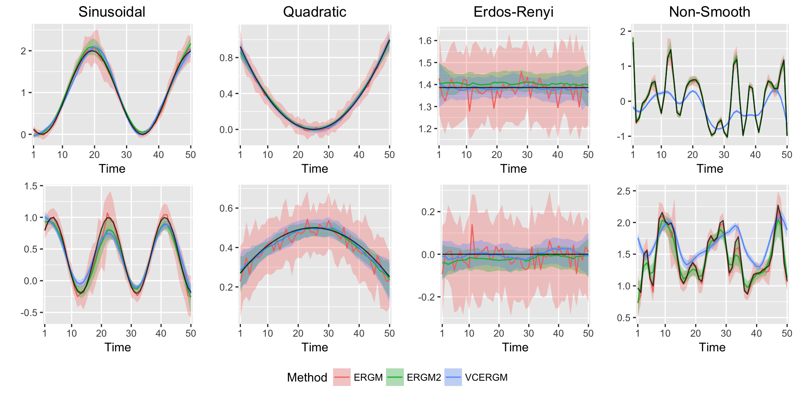

 

#### R Package ‘VCERGM'
The R package 'VCERGM' implements varying-coefficient random graph models (VCERGMs) on dynamic networks. R package is available on [github](https://github.com/jihuilee/VCERGM).

  
