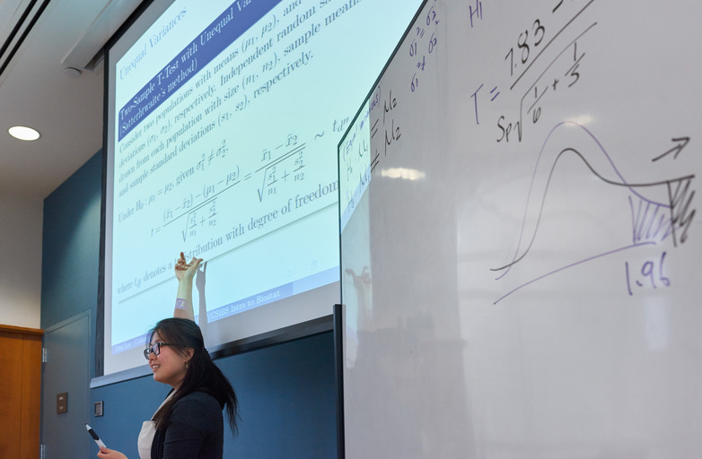

  

 

 
BEST/CSIBS at Columbia University, 2015

  

## Honor

* Columbia Presidential Teaching Award for Graduate Student Instructors, 2018

 

## Instructor

#### Full responsibility of curriculum, lectures, homework and exams

  

* Columbia University
    + Statistical Computing with SAS (P6110: Master Level), Spring 2016 - 2018; Fall 2016 - 2017; Summer 2018
    + Introduction to Biostatistics (P6103: Master Level), Summer 2014 - 2018
      (The Biostatistics Enrichment Summer Training Diversity Program (BEST) and Columbia Summer Institute for Training in Biostatistics (CSIBS))

  

## Teaching Assistant

#### Holding regular office hours & tutorials and grading assignments

* Columbia University
    + Theory of Statistical Inference 2 (P9110: Ph.D. Level), Spring 2016 - 2017
    + Theory of Statistical Inference 1 (P9109: Ph.D. Level), Fall 2014 - 2016
    + Linear Regression Models (P8111: Master Level), Spring 2015
    + Introduction to Biostatistical Methods (P6104: Master Level), Summer 2014, 2017

* Seoul National University
    + Statistical Seminar (Undergraduate Level), Spring & Fall 2013
    
* University of Seoul
    + Mathematical Statistics (Undergraduate Tutor), Fall 2011

